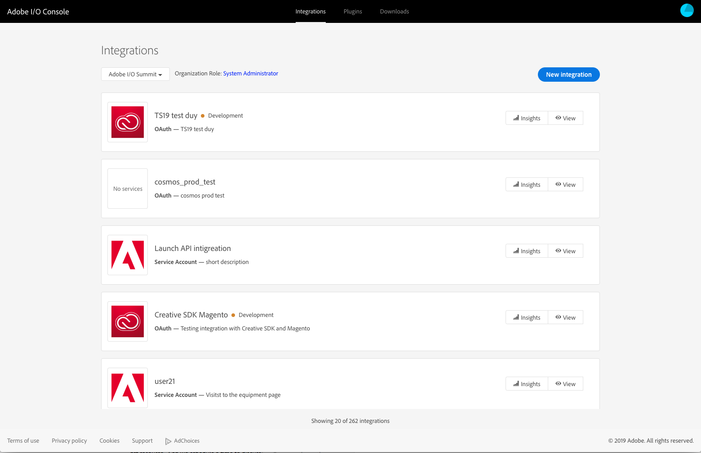
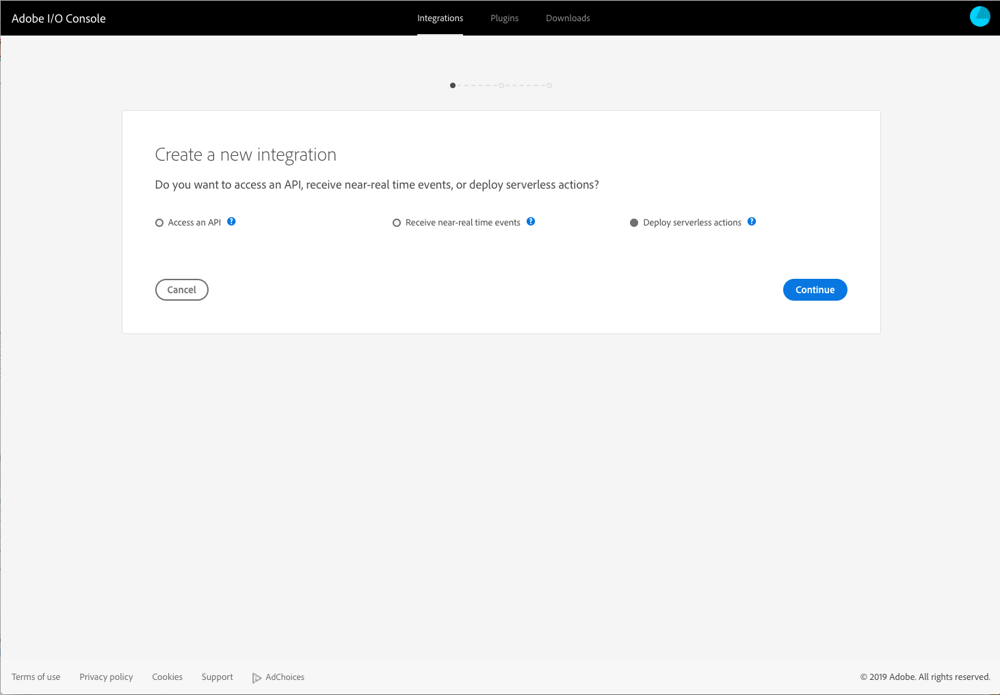
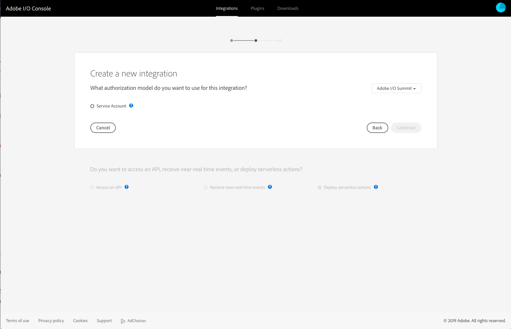
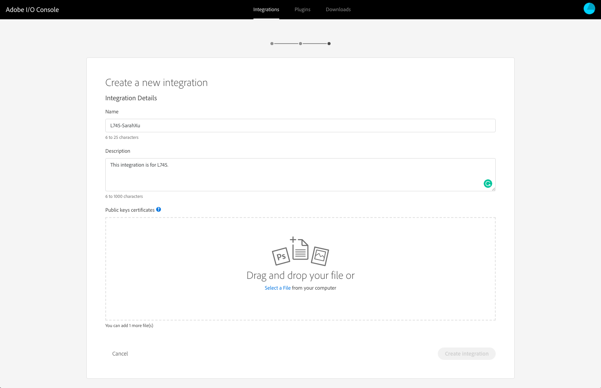
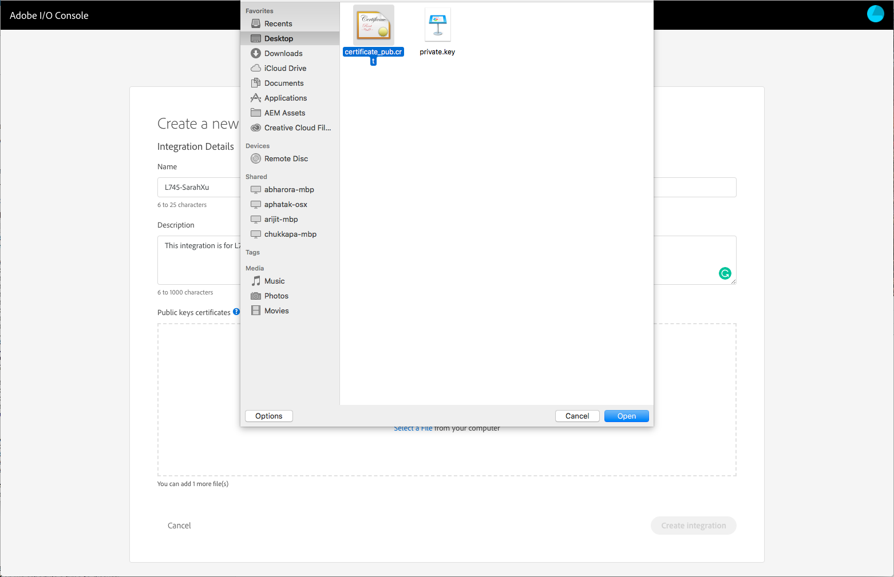
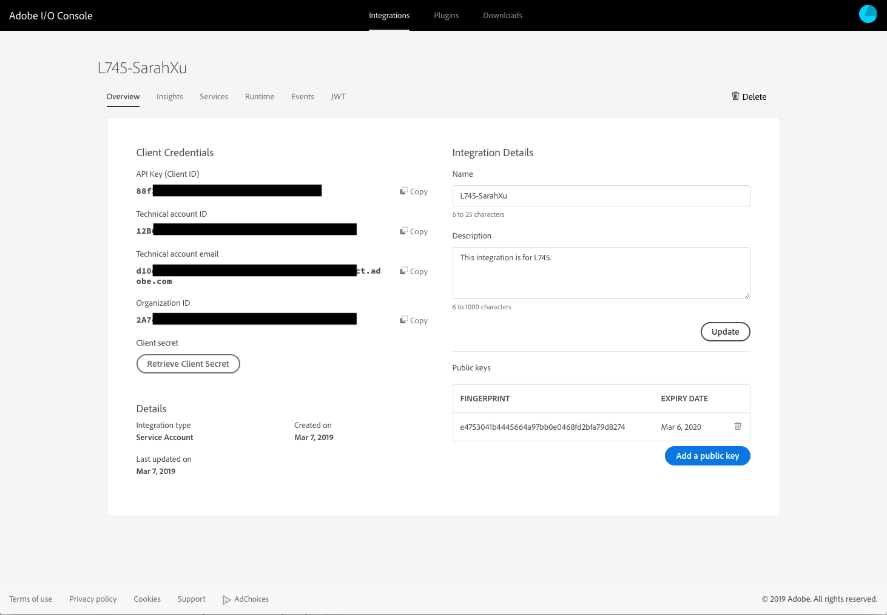
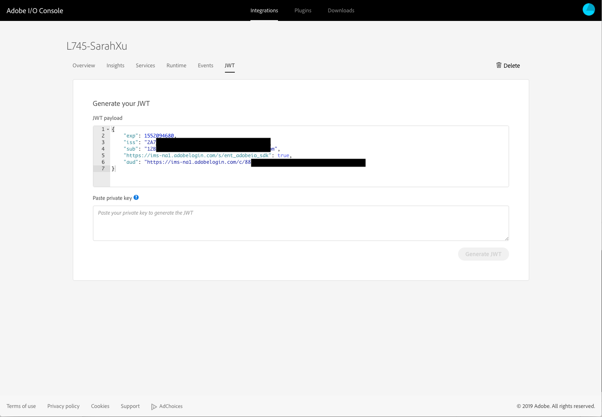

# Lesson 1. Set up your Runtime Namespace

## Learning Objectives

- Understand how to use Adobe I/O Console
- Use Console to set up a Runtime Namespace
- Set up your Adobe I/O CLI

## Lab Tasks

- Download all required resources
- Create new Integration on I/O Console
    - Log into Adobe I/O Console
    - Create new Integration for a Runtime Namespace
- Set up your Adobe I/O CLI (aio-cli)
    - Configure the CLI to access your org
    - Set up Runtime Namespace

---

## Download all required resources

- Download the [resources package](./resources.zip)
- Unzip it and place all content on your Desktop

## Create new Integration on I/O Console

**GOAL:** In this section, we are going to set up a new Integration on Adobe I/O Console that creates a new Runtime namespace.

### 1. Create Public Certificate
1. Open your Terminal and run the follow commands
    ```
    $ cd ~/Desktop
    $ openssl req -x509 -sha256 -nodes -days 365 -newkey rsa:2048 -keyout private.key -out certificate_pub.crt
    ```
2. Fill in the information as prompted for your certificate

    

### 2. Create Config.json File

1. Navigate to Adobe I/O Console at [https://console.adobe.io](https://console.adobe.io) in your browser
    - Login with the `Lab Administration` administrator credential that are provided on the front page.
    
2. Select `Integrations`, and you should see the following screen
    
3. Select `New Integration`, then `Deploy serverless actions` and click `Continue`
    
4. Select `Service Account` and click `Continue`
    
5. Fill in your Name and Description on this page, please use `L745-` + `YourName` (e.g. `L745-SarahXu`) as the name for your integration. 
    
6. From the first part, you should now see 2 new files on your Desktop, `certificate_pub.crt` and `private.key`. Upload the `certificate_pub.crt` file in your browser to create your Integration
   
7. After creating your integration, you will be able to view the details of your integration. Your screen should look similar to this.
    


---
## Set up your Adobe I/O CLI

**GOAL:** In this section, we are going to set up Adobe I/O CLI that allows you to interact with your Runtime namespace.

### 1. Create Config.json File
1. Find a `config.json` file on your Desktop. We are going to fill in the details based on the Integration you just created.
    ```
    {
      "client_id": "value from your Console Integration (String)",
      "client_secret": "value from your Console integration (String)",
      "jwt_payload": { value from your Console integration (JSON Object Literal) },
      "token_exchange_url": "https://ims-na1.adobelogin.com/ims/exchange/jwt",
      "console_get_orgs_url":"https://api.adobe.io/console/organizations",
      "console_get_namespaces_url":"https://api.adobe.io/runtime/admin/namespaces/"
    }
    ```
1. Open the Integration you just created, from the `Client Credentials` list, copy the value of `API Key (Client ID)` to replace the `client_id` in `config.json`, and `Client secret` to replace the `client_secret`. 
    
1. Navigate to the JWT tab on your Integration, you should see the `JWT payload` block, copy it to replace the `jwt_payload` line in `config.json`.
    
1. Save all your changes and your `config.json` should look something like this:
    ```
    {
      "client_id": "88f3xxxxxxxxxxxxxxxxxxxxx",
      "client_secret": "68fabxxxxxxxxxxxxxxxxxxxxx",
      "jwt_payload": { 
        "exp": 1552094680,
        "iss": "2A74xxxxxxxxxxxxxxxxxxxxx@AdobeOrg",
        "sub": "12Bxxxxxxxxxxxxxxxxxxxxx@techacct.adobe.com",
        "https://ims-na1.adobelogin.com/s/ent_adobeio_sdk": true,
        "aud": "https://ims-na1.adobelogin.com/c/88f37bcfxxxxxxxxxxxxxxxxxxxxx" 
      },
      "token_exchange_url": "https://ims-na1.adobelogin.com/ims/exchange/jwt",
      "console_get_orgs_url":"https://api.adobe.io/console/organizations",
      "console_get_namespaces_url":"https://api.adobe.io/runtime/admin/namespaces/"
    }
    ```
### 2. Configure Adobe I/O CLI
1. To configure your Adobe I/O CLI, open your Terminal and run the following commands:
    ```
    $ aio config set jwt-auth ~/Desktop/config.json --file --mime-type=application/json
    $ aio config set jwt-auth.jwt_private_key ~/Desktop/private.key --file --mime-type=application/x-pem-file
    ```
1. Your Adobe I/O CLI is now configured for your Organization. You can run the following command to validate:
    ```
    $ aio jwt-auth access-token
    ```
    should return an `Access Token` that looks like
    
### 3. Select your Integration
1. Now that your Adobe I/O CLI is configured, you can use it to select your Integration. Run the following command:
    ```
    $ aio console list-integrations
    ```
    this command returns a full of integrations in your Organization
    ```
    Success: Page 1 of 1, Showing 2 results of 2 results.
    <OrgID_IntegrationID> : <Integration Name 1>
    <OrgID_IntegrationID> : <Integration Name 2>
    ```
1. Find your Integration from this list. You can use the following command to look to the next page if you need to:
    ```
    $ aio console list-integrations --page=2
    ```
1. Once you identified your integration, use the <OrgID_IntegrationID> to select it
    ```
    $ aio console select-integration <OrgID_IntegrationID> 
    ```
    This step tells your CLI that now you want to interact with the Runtime namespace tied with this Integration.
    
### 3. Add Runtime Plugin for your Adobe I/O CLI
1. Let's build and install the Runtime Plugin for your Adobe I/O CLI
    ```
    $ cd ~/Desktop/aio-cli-plugin-runtime-master/
    $ npm install -g
    $ aio plugins link .
    ```
    If you run into any issues when you run the last command, try running the commands below:
    ```
    $ npm install -g globby
    $ aio plugins link .
    ```
1. You can validate this by typing in the following command:
    ```
    $ aio runtime property get
    ```
    which should return your Runtime credentials
    ```
    whisk auth		0ae3xxxxxxxxxxxxxxxxxxxxxxxxxxxxxxxxxxxxxxxxxxxxxxxxxxxxxx
    whisk API host		https://adobeioruntime.net
    whisk namespace		43611_xxxxx
    ```
---

### Navigate

| **Next:**                                                        |
| ---------------------------------------------------------------- |
| Lesson 2 - [Create your first Runtime Action](chapter-2.md) |

**Return Home:** [Workbook Index](../README.md)
