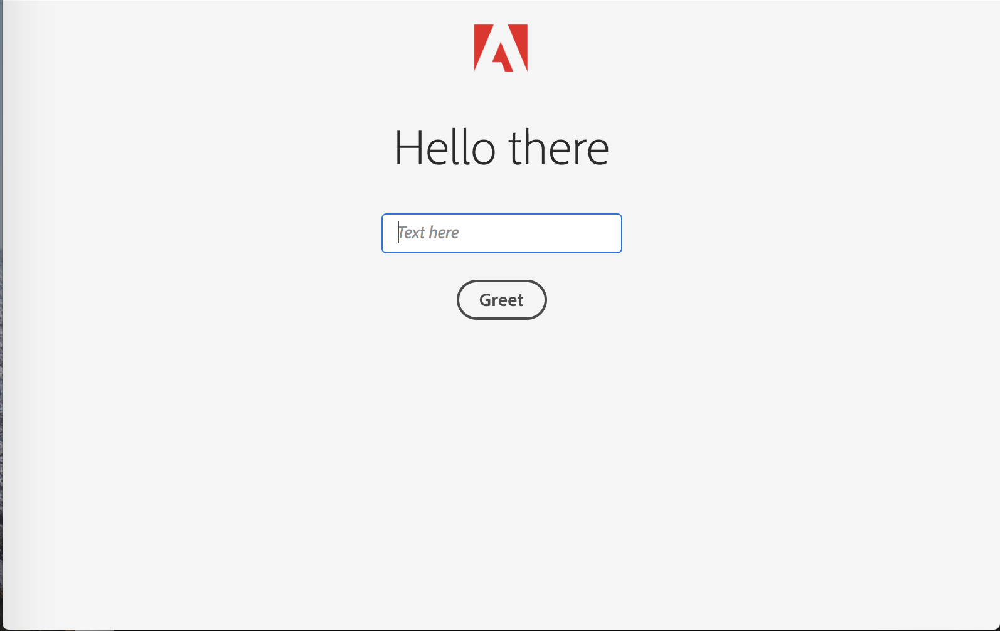
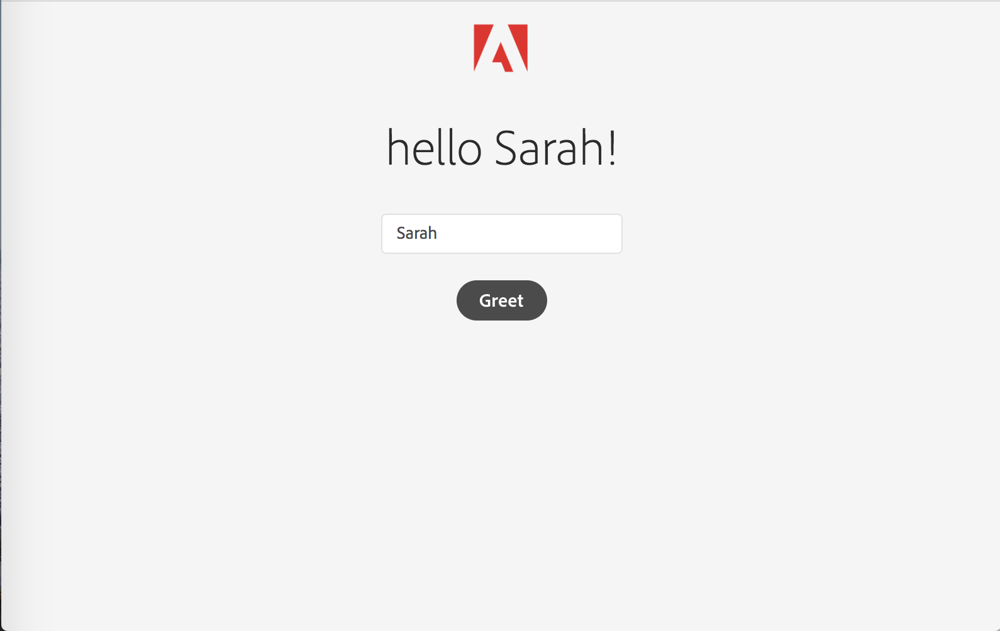
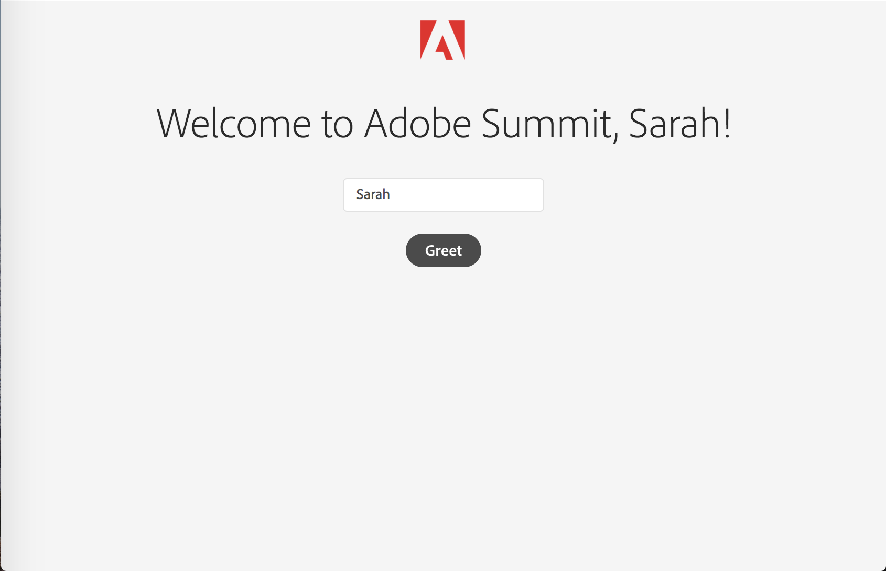

# Chapter 5. [Bonus] Use Project Starter to build an app with UI

## Learning Objectives

- Use the Adobe I/O Cloud Native Application Project Starter to kick off an app with UI

## Lab Tasks

- Configure Adobe I/O CNA Project Starter
- Make changes to the actions for testing

---

## 1. Configure Adobe I/O CNA Project Starter
**GOAL:** We will configure Adobe I/O CNA Project Starter

The Project Starter is a sample Cloud Native Application built on React. It provides some simple actions and UI components that helps you kick off development on Runtime. Let's first set up the project. 
1. Download the [chapter 5 package](../chapter5.zip)
1. Unzip it and place the content of the folder on the Desktop
1. Navigate to `runtime-cna-starter-summit` folder
    ```
    $ cd ~/Desktop/runtime-cna-starter-summit
    ```
1. Similar to the last chapter, we are also using use a `.env` file to configure this library to your integration. Run the following commands
    ```
    $ open .env
    ```
1. You should see something that looks like this:
    ```
    OW_APIVERSION=v1
    OW_APIHOST=https://adobeioruntime.net
    OW_AUTH=XXXXXX
    OW_NAMESPACE=XXXXXXX
    S3_TVM_URL=https://adobeioruntime.net/api/v1/web/cna-demo/tvm/get-s3-upload-token
    ```
1. You'll need to add the `OW_AUTH` and `OW_NAMESPACE` value, which you can find using your Adobe I/O CLI
    ```
    $ aio runtime property get
    ```
    `OW_NAMESPACE` should map to your `whisk namespace`, while `OW_AUTH` should map to your `whisk auth`. 

## 2. Deploy your Project Starter locally
**GOAL:** We will deploy and play with the Adobe I/O CNA Project Starter locally in this section.

One of the features of the CNA Project Starter is local development and testing. In the following section, we'll deploy your Project Starter locally, and play with the actions to familiarize with the project structure.
1. Let's start start your local Dev server
    ```
    $ npm run dev
    ```
    When you see the following message, your app has been deployed locally
    ```
    ⠋ Building...Serving on port 9080
    ✨  Built in  x s
    ```
1. You can now go to http://localhost:9080/ to see your locally deployed CNA. 
1. By default, you should see the following page.
    
1. If you type your name into the textbox, and click `Greet`, the title should change accordingly.
    

When the Project Starter is deployed locally, the local dev server uses an expressJS proxy to invoke action code. The UI is simple React application, with the default defined in `~/Desktop/runtime-cna-starter-summit/web-src/src/pages/Hello.js`. 
1. Let's open this file in Visual Studio Code. 
1. In line 14 of this file, you can see that the default greeting is set to `Hello there`. Let's change it to `Hello Adobe Summit` and save this file.
1. Go back to your browser at `http://localhost:9080/`, you should see the UI updated accordingly.

The `Greet` button is linked to the backend options, which takes in the input from the text field and generates "Hello x" type phrase. You can find it at `~/Desktop/runtime-cna-starter-summit/actions/hello/index.js`. Let's change it a bit as well.
1. Let's open this file in Visual Studio Code. 
1. In line 26 of this file, you can see that the response is set to `hello ${name}!`. Let's change it to `Welcome to Adobe Summit, ${name}!` and save this file.
1. Go back to your browser at `http://localhost:9080/`, type in your name in the text field, and you should see your change reflected immediately.
    

1. You can also invoke your back-end actions defined locally via the url. Try http://localhost:9080/actions/hello?name=yourname, and you should be able see a json representation of the response.
1. In addtion, there are built-in tests and reports for this project starter. You can simply run `npm run test` to run tests or `npm run coverage` to generate a code coverage report.

## 3. Deploy your CNA Project Starter into the cloud
**GOAL:** We will deploy the Adobe I/O CNA Project Starter into the cloud in this section.

Let's assume you are now happy with your application and ready to deploy it into the cloud. Using the following build and deploy commands, the actions will be deployed into your Runtime namespace, while the static assets deployed into an Adobe-hosted S3 bucket.
1. Let's start start your local Dev server
    ```
    $ npm run build
    $ npm run deploy
    ```
    Upon success, you should see the folloiwng message
    ```
    Deployment succeeded 🎉
    Access your app @ https://s3.amazonaws.com/adobe-cna/xxxxxx/runtime-cna-starter-1.0.0/index.html !
    ```
1. Open the URL listed, and voila -- you can now see your first Cloud Native Applicated running in the cloud!

## 4. What's next

Adobe I/O CNA will be available on GitHub in May, 2018. Sign up for our newsletter to stay tuned! 
http://bit.ly/aio-cna

---

**Return Home:** [Workbook Index](../README.md)
